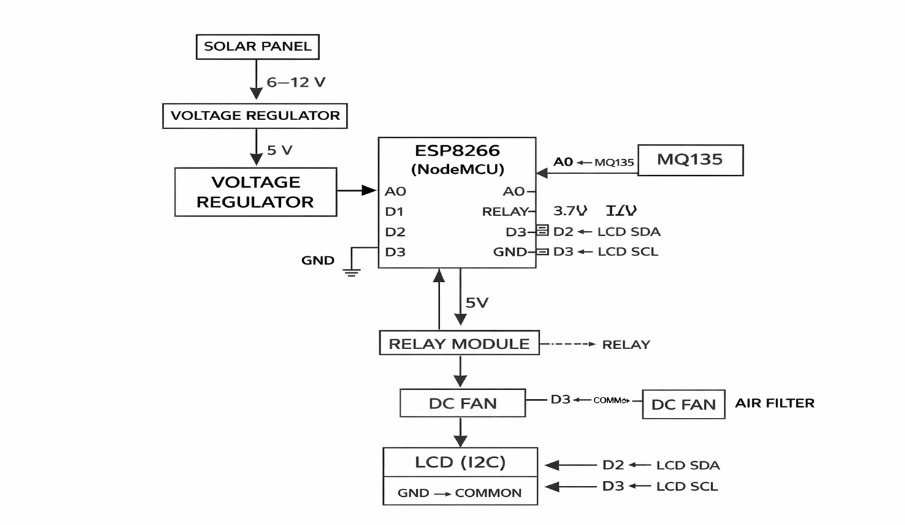
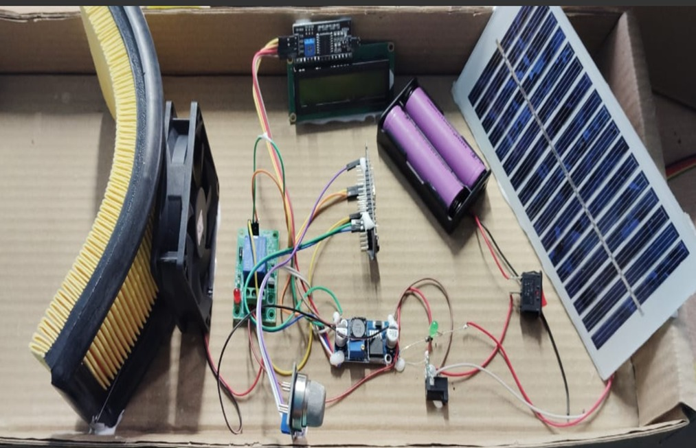

# Ambient Air Monitoring and Purification Using Solar

Developed a solar-powered system for monitoring ambient air quality and performing air purification based on pollution in surrounding air.  
The project integrates environmental sensing, embedded systems, and renewable energy concepts as part of an academic project.

---

## About This Project

This project focuses on monitoring ambient air quality and performing air purification using a solar-powered system.  
The objective of the project is to continuously monitor air pollution levels and activate a purification mechanism when the pollution crosses a predefined AQI threshold.

The system uses air quality sensors to detect pollution levels in the surrounding environment.  
A microcontroller (ESP8266) processes the sensor data and controls the purification unit such as a fan or filter.  
Solar energy is used as the primary power source, making the system energy-efficient and suitable for outdoor applications.

This project was developed as an academic project to study environmental monitoring, embedded systems, and renewable energy integration.

---

## Components Used

- Gas Sensor (MQ135)
- Microcontroller (ESP8266)
- Solar Panel (12V)
- Battery and Charge Controller
- Relay Module
- Air Purification Unit (Fan / Filter)

---

## System Interface Diagram

---

## Hardware Setup

### Hardware Setup – View 1

### Hardware Setup – View 2
.jpeg)

---

## Software Used

- C Programming
- Arduino IDE

---

## Working Principle

The air quality sensor continuously monitors the surrounding air.  
When the pollution level exceeds the set AQI threshold, the microcontroller activates the relay to turn **ON** the purification unit.  
When the air quality returns to normal levels, the purification unit is turned **OFF** automatically.

The entire system operates using power generated from a solar panel and stored in a battery.

---

## Results

- Continuous air quality monitoring achieved
- Automatic purification based on AQI threshold
- Efficient operation using solar power
- Reduced human intervention

---

## Applications

- Environmental Monitoring
- Pollution Control Systems
- Smart Cities
- Solar-Powered Monitoring Systems

---

## Author

**Hamsa M**  
GitHub: https://github.com/Hamsa-tech98
